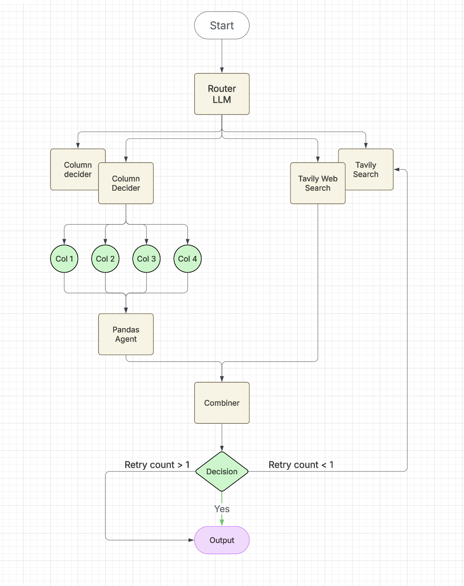
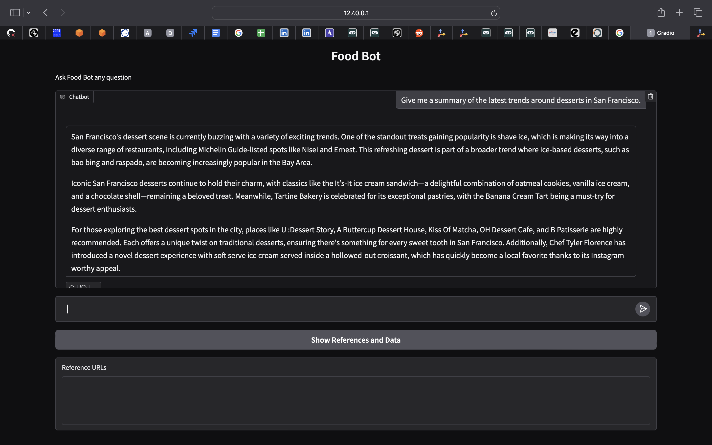
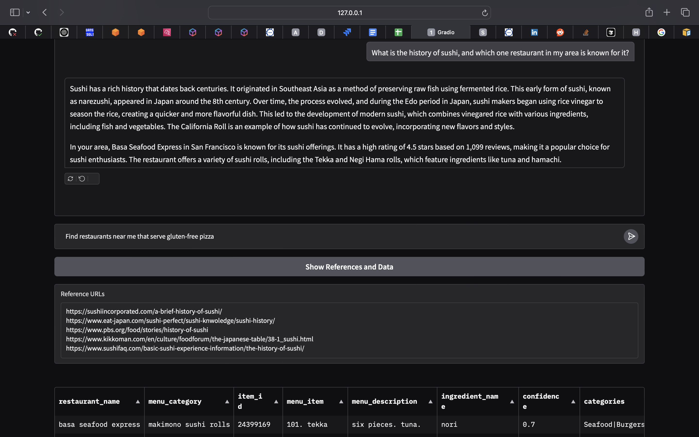
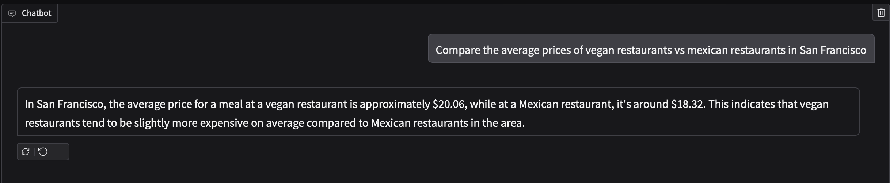
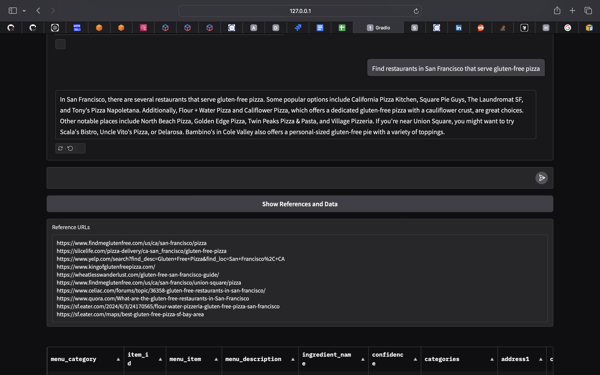

# 🍽️ EatsExplorer

An intelligent restaurant exploration system combining structured data querying with web search capabilities, using an asynchronous agentic architecture.

## 🌟 Key Features

- **Smart Query Processing**: Dynamically analyzes queries to determine if splitting is needed, then asynchronously executes the optimal combination of Pandas queries and web searches
- **Column-Based Indexing**: Chunks unique column values (20 items each) for efficient parameter discovery
- **Feedback Loop**: User-voted useful answers are stored in a separate index for improved future responses
- **Two-Step Search**: Falls back to extended web search if initial probe is insufficient
- **Interactive UI**: Built with Gradio for easy interaction and feedback collection

## 🏗️ Architecture

### Indexing Strategy
- Unique column values chunked into groups of 20
- Column names stored in chunk metadata
- Separate index for user-validated responses

### Query Pipeline
1. **Initial Probe**:
   - Query database using column-aware context
   - Fuzzy match user inputs with database values

2. **Extended Search** (if needed):
   - Trigger extended web search through Tavily
   - Combine results with database information

## 🛠️ Tech Stack

- **Frontend**: Gradio
- **Vector DB**: FAISS
- **Embeddings**: OpenAI (text-embedding-ada-002)
- **Tools**: Pandas Query Agent, Tavily Search
- **Frameworks**: LangChain, LlamaIndex

## 📋 Example

**Query**: "Best Restaurants in Courtland Ave"
- System detects misspelling of "Cortland Ave"
- Retrieves matching restaurants
- Falls back to web search if needed
- Collects user feedback for response improvement

## 📊 Examples

